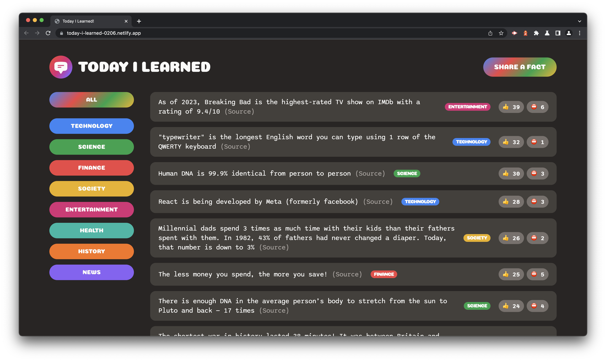
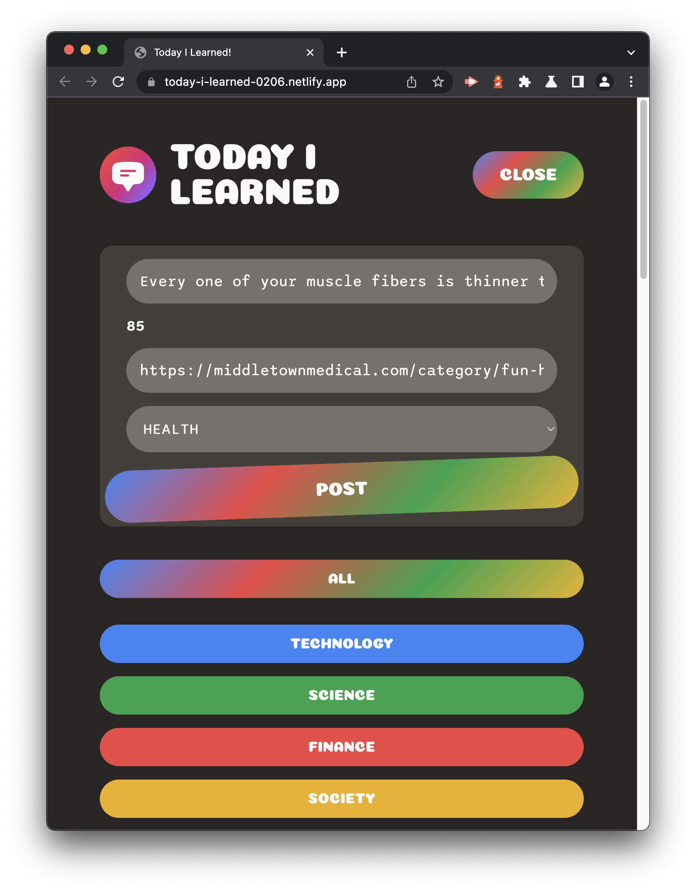
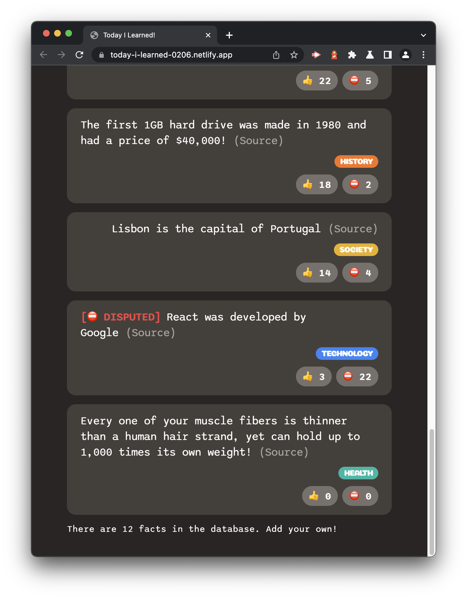
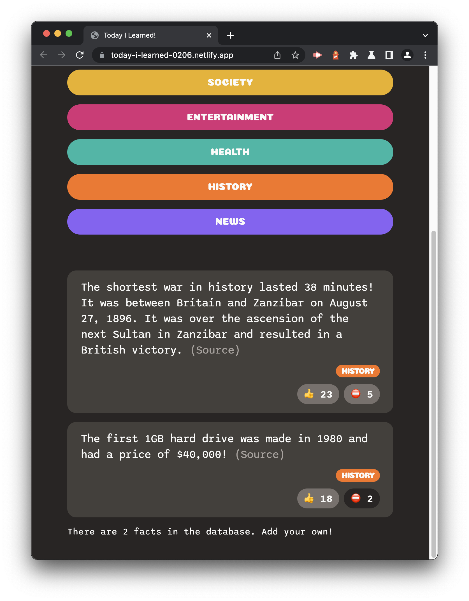
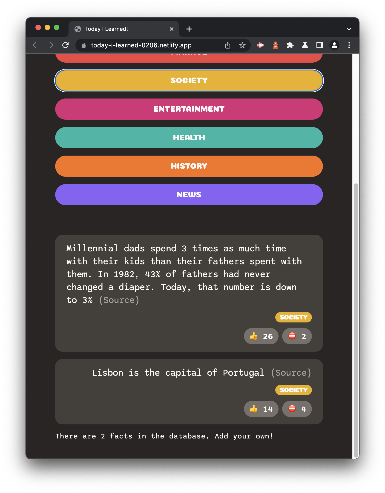

# Today I Learned

 

## License

 

[This application is under the MIT license](https://opensource.org/licenses/MIT)

 

## Deployment Link

 

 

[Deployment](https://today-i-learned-0206.netlify.app/)

 

☝🏻 Click there!

 

## Table of Contents

 

- [Today I Learned](#today-i-learned)
  - [License](#license)
  - [Deployment Link](#deployment-link)
  - [Table of Contents](#table-of-contents)
  - [Description](#description)
  - [Installation](#installation)
  - [Usage](#usage)
  - [Badges](#badges)
  - [Questions](#questions)
    - [GitHub](#github)
    - [Email](#email)

<small><i><a href='http://ecotrust-canada.github.io/markdown-toc/'>Table of contents generated with markdown-toc</a></i></small>

 

## Description

 

**Today I Learned** was a full-stack web application I built as a part of **Jonas Schmedtmann's** Udemy course `"Crash Course: Build a Full-Stack Web App in a Weekend!"` It features a React front-end and a back-end powered by Supabase. Users can view all of the facts in the database as well as facts by category, can vote on facts they think are interesting or false (if a fact has more downvotes than upvotes it will be flagged as disputed) and upload their own fact. During development I was able to continue learning about React components, hooks, props, etc. and I'm so excited for you to see the final product! If you wish to check it out simply click on the Netlify deployment link above.

 

## Installation

 

Clone the repository to your local machine, open your terminal, and navigate to the root folder in the **Today I Learned** repository. To install the necessary dependencies, run `npm i` in your command-line terminal.

 

## Usage

 

To upload a fact follow these steps:

1. Press the `Share a Fact` button to open the fact form
2. Enter your facts' text in 200 characters or less
3. Enter your trustworthy source beginning with `http://` or `https://`
4. Select a category
5. Press the `Post` button.

 

 

Down below you can see the fact I just created! Note that the fact **React was developed by Google** is disputed, as seen by the `[⛔️ DISPUTED]` that precedes it. For a fact to be disputed it must be voted false more than it was voted interesting. To vote on a fact simply press the `👍` or `⛔️` buttons as seen below as well.

 

 

 

Lastly, you can filter the facts in the database by their category type. Here we pressed the `Society` button to view only facts that relate to society.

 

 

## Badges

 

 

 

 

 

 

 

 

 

 

 

 

 

## Questions

 

If you have any additional questions, you can reach me at:

 

### GitHub

 

[jesterb0206](https://www.github.com/jesterb0206)

 

### Email

 

bradleyjester0@gmail.com

 
